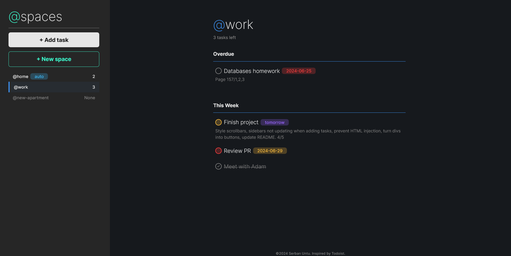

# Odin Todo List

## About
`@spaces` is an app to create and manage your todos, inspired by `Todoist`.
Most of the code is organised inside the `components` folder, where each subdirectory contains a `.js` file and a matching scoped stylesheet.
The codebase uses three global stylesheets, one for the reset, one for the main styles and one exclusively for utility classes.
The initial data is stored inside the `init.json` file, making it easier to access.
The code is separated into modules (`Space`, `Section`, `Task`, `Icon` etc.), with each of them having helper methods that are used to build the DOM elements quickly.
Sections divide a space into multiple time blocks (overdue, next week etc).
All data is contained in the `App.spaces` field, as an array of `Space` instances, with each of them containing an array of `Section` instances, and each section, an array of `Task` instances.
### Features
- A modern interface designed in Figma.
- The ability to create projects (spaces) that store tasks.
- The ability to edit the details of spaces and tasks.
- The ability to delete spaces and tasks.
- The ability to transfer tasks between different spaces.
- Immediate UI updates with each user interaction, without the need to refresh the page.
- Webpack and npm to build the code and manage the packages respectively.
## What I learned
The favicon path is specified in two places:
```html
<!-- index.html -->
<head>
  <link rel="icon" href="favicon.ico" type="image/ico">
<head>
```
```js
// webpack.common.js
plugins: [
  new HtmlWebpackPlugin({
    template: './src/index.html',
    favicon: './favicon.ico'
  })
],
```

The title of the webpage changes dynamically based on the current space.
```js
static loadSpace(space) {
  // ...
  document.title = `${space.name} | @spaces`;
}
```

To ensure the `@` symbol in the name of a space does not shift:
```css
h1.special {
  /* ... */
  span { /* targets `@` */
    vertical-align: text-top;
  }
}
```

Useful properties methods used by different modules:
```js
getComponent() {} // Creates and returns a DOM element from a `Space`, `Section` or `Task` instance
getComponentReference() {} // Queries the document and returns the DOM node created by an instance

// task/index.js
getSectionName() {} // Returns the name of the section that the task will be part of (based on its due date)

// src/index.js
static currentSpace; // A reference to the space that is currently loaded in the DOM.
                     // Very useful for updating the interface on the spot, without many lines of code
static IGNORE_SAVE_FLAG; // Used during development to disable the Saver module and thus interactions with localStorage
```
## Further development
- Buttons to change order of tasks / spaces
- Light theme
- Mobile support